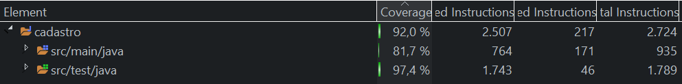

# Projeto de cadastro de clientes

# Objetivo

Crie uma solução de backend para ser executada em nuvem que proveja as seguintes funcionalidades através de serviços REST:

 + 	Cadastrar cidade 
 +	Cadastrar cliente 
 +	Consultar cidade pelo nome 
 +	Consultar cidade pelo estado 
 + Consultar cliente pelo nome 
 +	Consultar cliente pelo Id 
 +	Remover cliente 
 +	Alterar o nome do cliente 

 Considerações técnicas: 
 
 Nesse projeto foi considerado 2 entidades principais:
 
  + Cliente
  + Cidade

# Porcentagem de cobertura de testes
  
  
# Ferramentas 
  +  Java
  + Spring boot
  + PostgreSQL 
  + Jacoco

# Executando o projeto
  + [OpenShift Online](http://desafio-cadastro-cadastros.apps.us-east-2.starter.openshift-online.com/swagger-ui/index.html?configUrl=/v3/api-docs/swagger-config)
  

